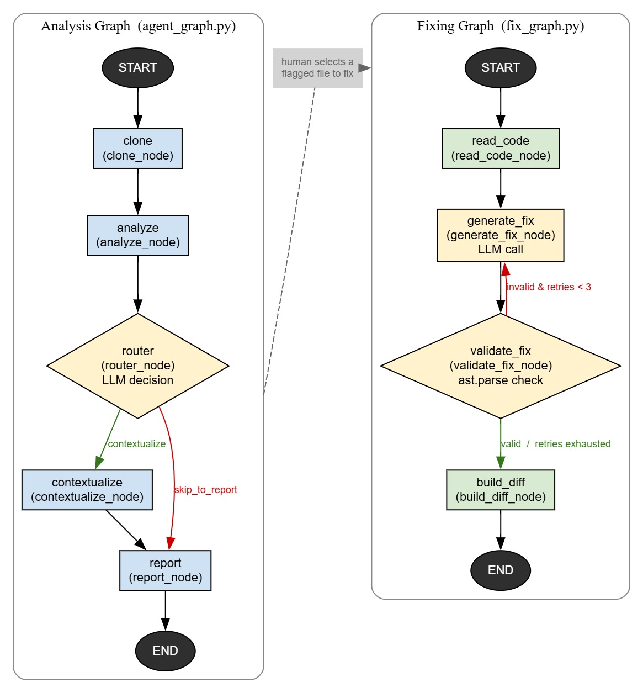

# CodeDebtAI

CodeDebtAI is an intelligent tool that automatically scans your software repositories to find **technical debt** — code that is overly complex, messy, or hard to maintain. It uses a team of specialized AI agents to identify the worst files, explain exactly why they are problematic, and automatically generate line-by-line code fixes to improve them. Finally, it presents all these insights and suggested code rewrites in a clean, user-friendly web dashboard so developers can quickly improve their codebase.

**Live app:** [https://code-debt-ai.vercel.app/](https://code-debt-ai.vercel.app/)
(Frontend deployed on Vercel, backend deployed on Render)

---

## How It Works

CodeDebtAI is built around two `langgraph` state-machine pipelines, powered by Groq-hosted LLMs (`llama-3.3-70b-versatile`):

1. **Analysis Workflow** — Clones a repo, runs static analysis, evaluates complexity/maintainability, uses an LLM to explain why code is bad, and generates a structured report.
2. **Fixing Workflow** — Takes a flagged file, uses an LLM to rewrite it with less complexity, validates that it parses correctly (with retries), and creates a line-by-line diff.



### 1. Analysis Workflow (`multi-agent/analysis/`)

Modeled as a state machine (`AgentState`) using `langgraph`:

| Node | File | Description |
|---|---|---|
| `clone` | `agent_nodes.py` | Clones the git repo and collects all `.py` files |
| `analyze` | `agent_nodes.py` | Runs `radon` via subprocess to compute Cyclomatic Complexity (cc) and Maintainability Index (mi) per file |
| `router` | `agent_router.py` | Counts high-complexity files (grades C–F) and asks the LLM whether to `contextualize` or `skip_to_report` |
| `contextualize` | `agent_nodes.py` | Computes a `priority_score` = `(100 - maintainability) + complexity`, filters the top 20 riskiest files, and uses a `ThreadPoolExecutor` to have the LLM generate a 1-sentence explanation for each |
| `report` | `agent_nodes.py` | Builds the final `ReportOutput`, including an overall `health_score`, for the UI |

`agent_graph.run_agentic_pipeline` is the drop-in agentic replacement for the original linear `orchestrator.run_pipeline`.

### 2. Fixing Workflow (`multi-agent/fixing/`)

Triggered when a user selects a flagged file to fix. Modeled with `FixState`:

| Node | File | Description |
|---|---|---|
| `read_code` | `fix_nodes.py` | Loads the raw source of the target file |
| `generate_fix` | `code_fixing_agent.py` | Sends the code + AI-generated `issue_reason` to the LLM, requesting a lower-complexity rewrite, and strips markdown fences from the response |
| `validate_fix` | `fix_nodes.py` | Parses the suggested code with `ast.parse()`; on `SyntaxError`, loops back to `generate_fix` (up to 3 retries) |
| `build_diff` | `code_fixing_agent.py` | Uses `difflib.unified_diff` to build a structured, line-by-line diff for the frontend diff editor |

### 3. Shared Components (`multi-agent/shared/`)

- **`config.py`** — Environment variables and constants (`TEMP_CLONE_DIR`, `HIGH_COMPLEXITY_THRESHOLD`, `TOP_N_FILES`, `LLM_MODEL`, etc.)
- **`shared_models.py`** — Pydantic models used across both pipelines: `FileAnalysis`, `FileContext`, `ReportOutput`, `FixRequest`/`FixResponse`

---

## Tech Stack

**Frontend** (`frontend/`)
- Next.js 16 (React 19, TypeScript)
- Tailwind CSS 4, shadcn/ui, Framer Motion
- Monaco Editor (`@monaco-editor/react`) for the code/diff view

**Backend** (`backend/`)
- FastAPI + Uvicorn
- GitPython (repo cloning), ReportLab (PDF report generation)

**Multi-agent core** (`multi-agent/`)
- LangGraph (state machine orchestration)
- Groq (LLM inference — `llama-3.3-70b-versatile`)
- Radon (static analysis — complexity & maintainability)

---

## Project Structure

```
CodeDebtAI/
├── frontend/          # Next.js web dashboard
├── backend/           # FastAPI server (api.py) — bridges frontend and multi-agent pipelines
├── multi-agent/        # Core agentic intelligence
│   ├── analysis/       # Analysis workflow (clone → analyze → route → contextualize → report)
│   ├── fixing/         # Fixing workflow (read → generate fix → validate → diff)
│   ├── shared/         # Shared Pydantic models & config
│   └── main.py         # Standalone test script for both pipelines
└── requirements.txt
```

---

## Getting Started

### Prerequisites
- Node.js
- Python 3
- A [Groq API key](https://console.groq.com/) (set as `GROQ_API_KEY` in a `.env` file, used by `multi-agent/shared/config.py`)

### 1. Frontend

```bash
cd frontend
npm install
npm run dev
```

### 2. Backend

In a second terminal:

```bash
python3 -m venv venv
source venv/bin/activate
pip install -r requirements.txt
cd backend
python -m uvicorn api:app --reload
```

---

## Testing the Pipelines Directly

`multi-agent/main.py` runs the full lifecycle end-to-end on a test repository (`https://github.com/cosmicvibecoder/testing-code-debt.git`):

1. Runs the analysis LangGraph — the repo is cloned, analyzed by Radon, routed by the LLM, prioritized, and reported (trace logs and flagged files are printed).
2. Grabs the top flagged file and triggers the fixing workflow.
3. The fixing graph reads the file, asks the LLM to fix it, validates the syntax, and prints a formatted diff.
4. (Optional) `apply_fix` can be used to write the AI's changes back to disk.

```bash
cd multi-agent
python main.py
```
